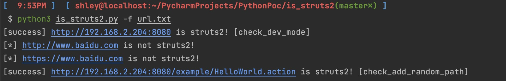

### 项目介绍

此项目参考于 [coffeehb](https://github.com/coffeehb/struts2_check) 师傅，使用 python3 编写

### 特点

#### 增加了两种 struts2 的检测方法

1. 基于 struts2 自带的 /struts/domTT.css 进行检测
2. 基于 struts2 框架的路由特点进行检测

细节及原理请查看原文章 https://cloud.tencent.com/developer/article/2037499

#### 支持多 url 检测

将要检测的域名放在 url.txt，使用 -f 参数即可进行检测


### 用法

```bash
python3 -u http://www.test.com # 单个域名检测
python3 -f url.txt # 批量检测
```